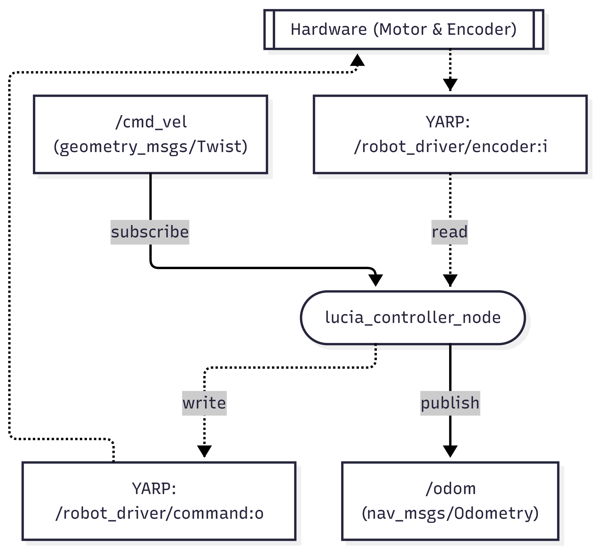

# lucia_controller

## 🚀 Overview
**lucia_controller** connects Lucia robot hardware to your ROS 2 ecosystem using YARP, featuring:

## 📦 Features
- Seamless integration between YARP and ROS 2.
- Launch files to bring up hardware interfaces.

## 🧩 Nodes & Topics
- `lucia_controller_node`: main hardware interface
- **Topics:**
  - `/cmd_vel` _(geometry_msgs/Twist)_
  - `/odom` _(nav_msgs/Odometry)_



## 📋 Requirements
- **OS:** Ubuntu 24.04
- **ROS version:** ROS 2 Jazzy
- **YARP:** Use a version older than `YARP-3.11`

## Setup
### YRAP

Install basic build tools
```bash
sudo apt install build-essential git cmake cmake-curses-gui
```
Install YCM (YARP CMake Modules) from source
```bash
git clone https://github.com/robotology/ycm/
cd ycm && mkdir build && cd build
cmake ..
make
sudo make install
```
Additional dependencies
```bash
sudo apt-get install -y build-essential git cmake cmake-curses-gui ycm-cmake-modules libeigen3-dev libace-dev libedit-dev libsqlite3-dev libtinyxml-dev qtbase5-dev qtdeclarative5-dev qtmultimedia5-dev qml-module-qtquick2 qml-module-qtquick-window2 qml-module-qtmultimedia qml-module-qtquick-dialogs qml-module-qtquick-controls qml-module-qt-labs-folderlistmodel qml-module-qt-labs-settings libqcustomplot-dev libgraphviz-dev libjpeg-dev libgstreamer1.0-dev libgstreamer-plugins-base1.0-dev gstreamer1.0-plugins-base gstreamer1.0-plugins-good gstreamer1.0-plugins-bad gstreamer1.0-libav
```
Build and install YARP
```bash
git clone -b yarp-3.11 https://github.com/robotology/yarp.git
cd yarp && mkdir build && cd build
cmake ..
make -j8
sudo make install
sudo ldconfig
```
> [!IMPORTANT]
> Use a version older than `YARP-3.11`

Verify YARP server
```bash
yarpserver
# Press CTRL-C to stop
# You should see "Ok. Ready!" if it started successfully.
```

YARP network configuration example
```bash
cd ~
yarp conf
cd ~/.config/yarp/
cp yarp.conf _lucia_g.conf
nano _lucia_g.conf
```
YARP network configuration example  
`_lucia_g.conf`
```yaml
192.168.1.221 10000 yarp
```
Set YARP namespace
```bash
yarp namespace /lucia_g
```
## ROS2 Packages install & build
Install robot-localization
```bash
sudo apt update
sudo apt install ros-${ROS_DISTRO}-nav-msgs ros-${ROS_DISTRO}-nav2-bringup ros-${ROS_DISTRO}-tf2-ros ros-${ROS_DISTRO}-tf2-geometry-msgs ros-${ROS_DISTRO}-joy ros-${ROS_DISTRO}-teleop-twist-joy ros-$ROS_DISTRO-twist-mux ros-${ROS_DISTRO}-cv-bridge ros-${ROS_DISTRO}-image-transport ros-${ROS_DISTRO}-vision-opencv ros-${ROS_DISTRO}-imu-complementary-filter ros-${ROS_DISTRO}-imu-tools ros-${ROS_DISTRO}-usb-cam
```
Clone & Build
```bash
cd ~/ros2_ws/src  #Go to ros workspace
git clone https://github.com/iHaruruki/lucia_controller.git #clone this package
cd ~/ros2_ws
colcon build --symlink-install --packages-select lucia_controller
source install/setup.bash
```

## 🎮 Usage
1. Power on Lucia and NUC 21
2. Power on [Lucia-04-Green-01-Main]
3. (Wi-Fi settings) Connect to [lucia-g-router]
4. Release the emergency stop button
5. Switch Lucia's mode to [Remote] (`remote`モードに切り替える)
6. Bringup Lucia ROS 2 system
```bash
ros2 launch lucia_controller bringup.launch.py 
```
7. Launch teleop or joystick controll
A robot-agnostic teleoperation node to convert keyboard commands to Twist
```bash
ros2 launch lucia_controller keyboard_teleop.launch.py
```
Generic joystick teleop for twist robots.
```bash
ros2 launch lucia_controller joystick_teleop.launch.py
```

## 🛠️ Debug
## Debug mode
bringup.launch.py
```bash
ros2 launch lucia_controller bringup.launch.py log_level:=debug
```
lucia_minimal_controller_node
```bash
ros2 run lucia_controller lucia_minimal_controller_node --ros-args --log-level debug
```
lucia_velocity_smoother
```bash
ros2 run lucia_controller lucia_velocity_smoother_node --ros-args --log-level debug
```
## 📢 Troubleshooting
### YARP
Self-diagnostic command
```bash
yarp check
```
List all active ports
```bash
yarp name list
```
<details>
<summary>result</summary>
```bash
registration name /lucia-nuc-21 ip 192.168.1.221 port 10002 type tcp
registration name /robotFace/expression:i ip 192.168.1.221 port 10011 type tcp
registration name /robotFace/target:i ip 192.168.1.221 port 10006 type tcp
registration name /robotManager/data/rfid:i ip 192.168.1.221 port 10036 type tcp
registration name /robotManager/reha/con/image:i ip 192.168.1.221 port 10067 type tcp
registration name /robotManager/reha/control:o ip 192.168.1.221 port 10063 type tcp
registration name /robotManager/reha/pos/image:i ip 192.168.1.221 port 10065 type tcp
registration name /robotManager/reha/state:i ip 192.168.1.221 port 10064 type tcp
registration name /robotManager/reha/vel/image:i ip 192.168.1.221 port 10066 type tcp
registration name /robotManager/robot/cart:i ip 192.168.1.221 port 10051 type tcp
registration name /robotManager/robot/expression:o ip 192.168.1.221 port 10048 type tcp
registration name /robotManager/robot/map:o ip 192.168.1.221 port 10054 type tcp
registration name /robotManager/robot/mode:c ip 192.168.1.221 port 10055 type tcp
registration name /robotManager/robot/park:o ip 192.168.1.221 port 10049 type tcp
registration name /robotManager/robot/speech:i ip 192.168.1.221 port 10052 type tcp
registration name /robotManager/robot/urg:o ip 192.168.1.221 port 10047 type tcp
registration name /robotManager/vision/camera:i ip 192.168.1.221 port 10056 type tcp
registration name /robotManager/vision/detect:i ip 192.168.1.221 port 10058 type tcp
registration name /robotManager/vision/frame:o ip 192.168.1.221 port 10060 type tcp
registration name /robotManager/vision/sound:o ip 192.168.1.221 port 10059 type tcp
registration name /robotManager/vision/thermo:i ip 192.168.1.221 port 10057 type tcp
registration name /robotManager/vision/thermo:o ip 192.168.1.221 port 10061 type tcp
registration name /robotManager/vision/touch:o ip 192.168.1.221 port 10062 type tcp
registration name /root ip 192.168.1.221 port 10000 type tcp
registration name /soundGenerator/command:i ip 192.168.1.221 port 10014 type tcp
registration name /soundGenerator/state:o ip 192.168.1.221 port 10017 type tcp
registration name /soundGui/command:o ip 192.168.1.221 port 10053 type tcp
registration name /soundGui/state:i ip 192.168.1.221 port 10050 type tcp
registration name /tmp/port/1 ip 192.168.1.221 port 10003 type tcp
registration name /tmp/port/2 ip 192.168.1.221 port 10004 type tcp
registration name /tmp/port/3 ip 192.168.1.221 port 10005 type tcp
registration name /touchDetector/mode:i ip 192.168.1.221 port 10013 type tcp
registration name /touchDetector/sound:o ip 192.168.1.221 port 10019 type tcp
registration name /touchDetector/touch:i ip 192.168.1.221 port 10012 type tcp
registration name /urgTracker/cart:o ip 192.168.1.221 port 10032 type tcp
registration name /urgTracker/command:i ip 192.168.1.221 port 10015 type tcp
registration name /urgTracker/front/cart:o ip 192.168.1.221 port 10034 type tcp
registration name /urgTracker/front/polar:o ip 192.168.1.221 port 10037 type tcp
registration name /urgTracker/front/range:i ip 192.168.1.221 port 10018 type tcp
registration name /urgTracker/pose:o ip 192.168.1.221 port 10027 type tcp
registration name /urgTracker/rear/cart:o ip 192.168.1.221 port 10040 type tcp
registration name /urgTracker/rear/polar:o ip 192.168.1.221 port 10042 type tcp
registration name /urgTracker/rear/range:i ip 192.168.1.221 port 10021 type tcp
registration name /urgTracker/robotFace:o ip 192.168.1.221 port 10024 type tcp
registration name /urgTracker/state:o ip 192.168.1.221 port 10029 type tcp
registration name /vehicleController/expression:o ip 192.168.1.221 port 10038 type tcp
registration name /vehicleController/pose:i ip 192.168.1.221 port 10023 type tcp
registration name /vehicleController/project:i ip 192.168.1.221 port 10030 type tcp
registration name /vehicleController/reference:i ip 192.168.1.221 port 10026 type tcp
registration name /vehicleController/velocity:o ip 192.168.1.221 port 10033 type tcp
registration name /vehicleDriver/assist:i ip 192.168.1.221 port 10045 type tcp
registration name /vehicleDriver/enable:i ip 192.168.1.221 port 10039 type tcp
registration name /vehicleDriver/encoder:o ip 192.168.1.221 port 10016 type tcp
registration name /vehicleDriver/force:o ip 192.168.1.221 port 10020 type tcp
registration name /vehicleDriver/mode:i ip 192.168.1.221 port 10031 type tcp
registration name /vehicleDriver/mode:s ip 192.168.1.221 port 10046 type tcp
registration name /vehicleDriver/park:i ip 192.168.1.221 port 10044 type tcp
registration name /vehicleDriver/reference:o ip 192.168.1.221 port 10022 type tcp
registration name /vehicleDriver/remote:i ip 192.168.1.221 port 10043 type tcp
registration name /vehicleDriver/state:o ip 192.168.1.221 port 10025 type tcp
registration name /vehicleDriver/touch:i ip 192.168.1.221 port 10035 type tcp
registration name /vehicleDriver/touch:o ip 192.168.1.221 port 10028 type tcp
registration name /vehicleDriver/velocity:i ip 192.168.1.221 port 10041 type tcp
registration name fallback ip 224.2.1.1 port 10000 type mcast
*** end of message
```
</details>

```bash
yarp exists /port_name
```
View the live data stream
```bash
yarp read /read/encoder:i /vehicleDriver/encoder:o
```


## 📜 License

## 👤 Authors

- **[iHaruruki](https://github.com/iHaruruki)** — Main author & maintainer

## 📚 References
- [YARP](https://github.com/robotology/yarp)
- [YCM](https://github.com/robotology/ycm)
- [ROS 2 Humble](https://docs.ros.org/en/humble/)
- [ros2_control](https://control.ros.org/humble/index.html)
- [robot localization](https://docs.ros.org/en/melodic/api/robot_localization/html/index.html)
- [joy](https://docs.ros.org/en/humble/p/joy/index.html)
- [teleop_twist_keyboard](https://docs.ros.org/en/humble/p/teleop_twist_keyboard/)
- [teleop_twist_joy](https://docs.ros.org/en/iron/p/teleop_twist_joy/)
- [twist_mux](https://wiki.ros.org/twist_mux)
- [twist_mux (GitHub)](https://github.com/ros-teleop/twist_mux.git)
